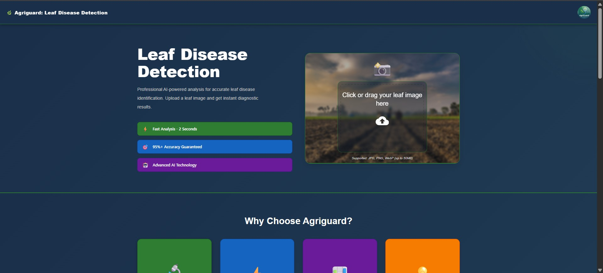
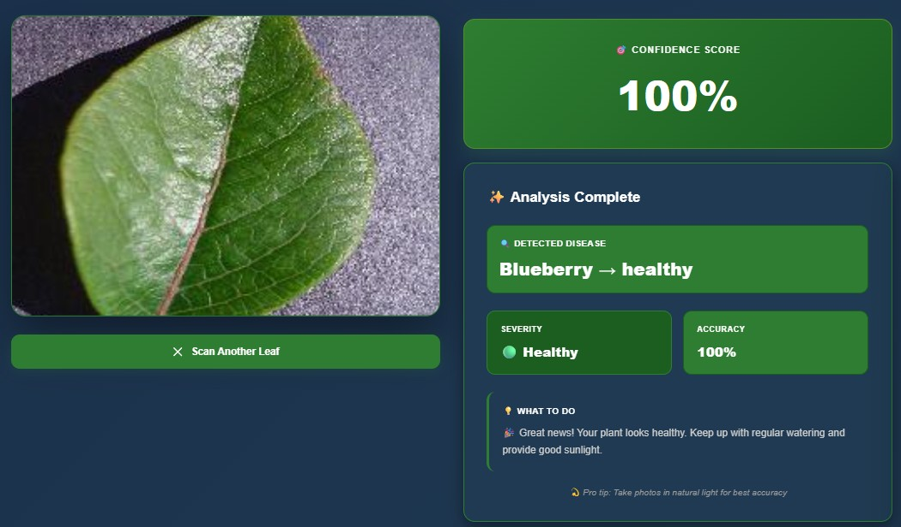
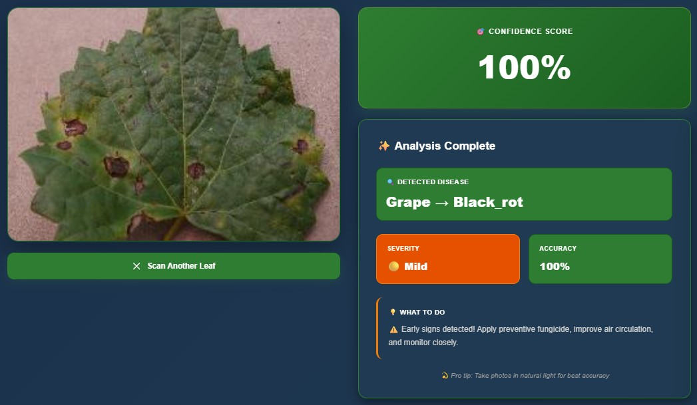
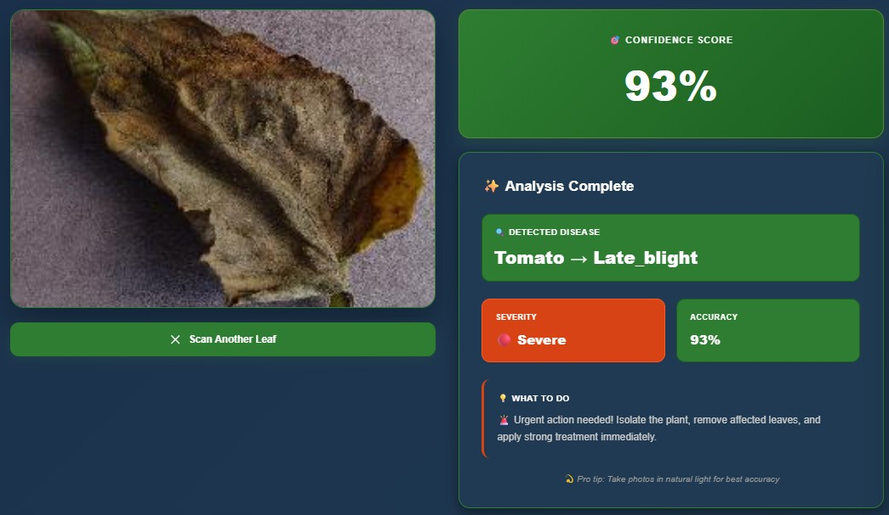

# 🌱 AgriGuard – AI Crop Disease Detection & Severity Assessment System

<p align="center">
  
  
  
  
  
  
</p>

---

## 🚀 Overview

**AgriGuard** is an end-to-end AI-powered crop disease detection system that automatically identifies plant diseases from leaf images and provides severity-based treatment guidance using an intelligent chatbot.

The system combines:

* 🧠 Deep Learning (MobileNetV2)
* ⚙️ FastAPI Backend
* 🎨 React Frontend
* 💬 LLM-Based Chatbot

👉 Designed to bridge the gap between **AI research and real-world agricultural use**

---

## 🎯 Problem Statement

* 🌾 20–40% crop loss due to diseases
* 🧑‍🌾 Requires expert knowledge
* ⏱️ Manual diagnosis is slow & inconsistent
* ❌ Most AI models are not deployed

👉 AgriGuard provides a **fully deployable AI solution with real-time guidance**

---

## 💡 System Architecture

<p align="center">
  
</p>

```text
Leaf Image → Preprocessing → MobileNetV2 → FastAPI → React UI → LLM Chatbot
```

---

## 🧠 Model Details

| Feature    | Value                            |
| ---------- | -------------------------------- |
| Model      | MobileNetV2 (Transfer Learning)  |
| Dataset    | PlantVillage                     |
| Images     | 50,000+                          |
| Classes    | 38                               |
| Input Size | 128×128                          |
| Training   | Feature Extraction + Fine-Tuning |

---

## 📊 Performance

| Metric    | Score  |
| --------- | ------ |
| Accuracy  | 94.86% |
| Precision | 0.94   |
| Recall    | 0.94   |
| F1 Score  | 0.94   |

---

## 🧪 Dataset

* 50,000+ labeled images
* 38 disease classes
* 14 plant species
* 80 / 10 / 10 split
* Augmentation: rotation, flip, zoom

---

## ⚙️ Tech Stack

### 🧠 AI / ML

* TensorFlow / Keras
* MobileNetV2
* NumPy, Pandas

### 🔙 Backend

* FastAPI
* REST API

### 🎨 Frontend

* React.js

### 💬 Chatbot

* LLM-based response system
* Disease explanation + treatment guidance

---

## ✨ Features

* ✅ Real-time disease detection
* ✅ 38-class classification
* ✅ Confidence score
* ✅ Severity detection (Healthy / Mild / Severe)
* ✅ LLM-based chatbot guidance
* ✅ End-to-end system

---

## 💬 Chatbot Example

**User:** What disease is this?
**AI:** Tomato Late Blight detected (94% confidence) — SEVERE

**User:** What should I do?
**AI:** Remove infected leaves, apply fungicide, avoid overhead watering

---

## 📸 Screenshots

### 🏠 Homepage

<p align="center">
  
</p>

### 📊 Results

<p align="center">
  
  
  
</p>

---

## 🚀 How It Works

1. Upload leaf image
2. Backend preprocesses image
3. Model predicts disease
4. System calculates confidence + severity
5. Chatbot provides explanation & guidance

---

## ⚠️ Limitations

* Dataset is lab-based
* Similar diseases may confuse model
* Not cloud deployed yet

---

## 🔮 Future Work

* ☁️ Cloud deployment (AWS / Azure)
* 🌍 Real-world dataset
* 🌐 Multilingual chatbot
* 🚁 Drone & IoT integration

---

## 🌍 Applications

* Smart farming
* Crop monitoring
* Agricultural AI systems

---

## 👨‍💻 Team

* Himanshu Patel
* Jande Tarfa
* Theo Agunu

🎓 Saskatchewan Polytechnic – AI & Data Analytics
📅 April 2026

---
